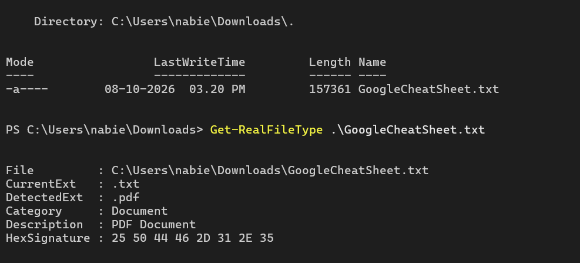

# 🔍 WinFile (Get-RealFileType)

> **A lightweight, dependency-free PowerShell tool that inspects magic bytes and container structures to identify actual file types on Windows — just like the Linux `file` utility.**

[](https://github.com/PowerShell/PowerShell)
[](https://www.microsoft.com/windows)
[](LICENSE)
[](https://github.com/)

---

## 💡 Overview

On Linux, developers and sysadmins rely on the `file` command to determine what a file actually is by analyzing its **magic numbers** (header signatures) rather than trusting its file extension.

Windows lacks a native, built-in equivalent that detects deep signatures out-of-the-box. **WinFile (`Get-RealFileType`)** brings this capability to PowerShell with:
- **Zero third-party dependencies** (uses pure .NET binary reading).
- **In-memory OpenXML/ZIP inspection** to tell `.docx`, `.xlsx`, `.pptx`, `.jar`, and `.apk` apart.
- **In-memory OLE Compound File (CFB) inspection** to differentiate legacy `.doc`, `.xls`, `.ppt`, and `.msg` files.
- **Support for PowerShell pipeline operations**, batch scanning, mismatch detection, and auto-renaming.

---

## ✨ Features

- 🎯 **Accurate Signature Matching**: Inspects raw binary header bytes across 35+ file formats.
- 📦 **Deep Container Inspection**:
  - **ZIP / OpenXML**: Inspects internal catalog manifests in memory without writing temporary files to disk.
  - **OLE CFB (Legacy Office)**: Reads internal UTF-16LE stream directory sectors (`WordDocument`, `Workbook`, `PowerPoint Document`, `__substg1.0_`).
- ⚡ **Pipeline Friendly**: Seamlessly pipes from `Get-ChildItem` for instant multi-file/directory audits.
- 🛡️ **Security & Spoof Detection**: Easily spots disguised executables or malicious files masked with benign extensions (e.g. `invoice.pdf.exe` or `.exe` renamed to `.jpg`).
- 🪶 **100% Native**: Runs on standard Windows PowerShell 5.1 as well as PowerShell Core 7+.

---

## 📊 Supported Formats

| Category | Formats Supported |
| :--- | :--- |
| **Documents** | `PDF`, `DOCX`, `XLSX`, `PPTX`, `DOC`, `XLS`, `PPT`, `RTF`, `MSG`, `VSD`, `EPUB`, `ODF` |
| **Images** | `PNG`, `JPEG / JPG`, `GIF`, `BMP`, `WebP`, `TIFF`, `ICO`, `PSD` |
| **Audio & Video** | `MP4`, `MKV / WebM`, `AVI`, `WAV`, `MP3`, `FLAC`, `OGG`, `WMV / WMA (ASF)` |
| **Archives & Packages** | `ZIP`, `7z`, `RAR`, `GZIP (.gz)`, `BZIP2 (.bz2)`, `XZ`, `TAR`, `APK`, `JAR` |
| **Executables & Binaries** | `Windows EXE / DLL (PE/MZ)`, `Linux ELF`, `Java Class / Mach-O Fat`, `macOS Mach-O` |
| **Data & Databases** | `SQLite 3 (.db / .sqlite)`, `XML / SVG` |

---

## 🚀 Installation & Setup

### Option 1: Temporary Session (Quick Start)
1. Download `Get-FileType.ps1` from this repository.
2. In PowerShell, allow local script execution if prompted:
   ```powershell
   Set-ExecutionPolicy -Scope Process -ExecutionPolicy Bypass
   ```
3. Load the function via dot-sourcing:
   ```powershell
   . .\Get-FileType.ps1
   ```

---

### Option 2: Permanent Setup (Available in All Terminals)
Make `Get-RealFileType` a permanent command in every PowerShell window:

1. Create and open your PowerShell user profile:
   ```powershell
   New-Item -Path $PROFILE -ItemType File -Force
   notepad $PROFILE
   ```
2. Paste the entire content of `Get-FileType.ps1` into the profile file, save (**Ctrl + S**), and close Notepad.
3. Allow local profile execution:
   ```powershell
   Set-ExecutionPolicy -Scope CurrentUser -ExecutionPolicy RemoteSigned
   ```
4. Restart your terminal. `Get-RealFileType` is now globally available!

---

## 📖 Usage Examples



### 1. Identify a Single Mystery File
```powershell
Get-RealFileType -Path ".\unknown_payload"
```

**Output:**
```text
File         : C:\Users\User\Downloads\unknown_payload
CurrentExt   : (none)
DetectedExt  : .pdf
Category     : Document
Description  : PDF Document
HexSignature : 25 50 44 46 2D 31 2E 37
```

---

### 2. Scan All Files in the Current Folder
```powershell
Get-ChildItem -File | Get-RealFileType | Format-Table File, CurrentExt, DetectedExt, Description -AutoSize
```

---

### 3. Find Spoofed / Mismatched Files (Security Audit)
Find files whose actual internal type does not match their visible file extension:

```powershell
Get-ChildItem -File -Recurse | Get-RealFileType | Where-Object {
    $_.DetectedExt -notlike "*$($_.CurrentExt)*" -and $_.DetectedExt -ne "Unknown" -and $_.CurrentExt -ne "(none)"
} | Format-Table File, CurrentExt, DetectedExt, Description -AutoSize
```

---

### 4. Automatically Fix Missing File Extensions
Safely rename files that have no extension by appending their true detected extension:

```powershell
Get-ChildItem -File | Get-RealFileType | Where-Object {
    $_.CurrentExt -eq "(none)" -and $_.DetectedExt -notmatch "Unknown|Empty|/"
} | ForEach-Object {
    Rename-Item -LiteralPath $_.File -NewName "$($_.File)$($_.DetectedExt)"
    Write-Host "Renamed: $($_.File) -> $($_.File)$($_.DetectedExt)" -ForegroundColor Green
}
```

---

## 🛠️ How It Works

1. **Header Streaming**: Reads the initial 32 bytes of the target file into a managed byte array.
2. **Hex Pattern Matching**: Evaluates the signature against standardized magic byte regex definitions.
3. **Deep Container Inspection**:
   - For `50 4B 03 04` (ZIP headers), it initializes `System.IO.Compression.ZipArchive` strictly in memory to read schema paths (`word/`, `xl/`, `ppt/`, `AndroidManifest.xml`, `META-INF/`).
   - For `D0 CF 11 E0 A1 B1 1A E1` (OLE CFB headers), it decodes the directory allocation sectors into UTF-16LE strings to look for active stream signatures (`WordDocument`, `Workbook`, `PowerPoint Document`).
4. **Custom Object Output**: Emits structured `PSCustomObject` instances that directly support PowerShell piping, filtering, and export (`Export-Csv`, `Out-GridView`, etc.).

---

## 🤝 Contributing

Contributions are welcome! If you'd like to add support for additional file signatures or container types:
1. Fork the Project
2. Create your Feature Branch (`git checkout -b feature/NewSignature`)
3. Commit your Changes (`git commit -m 'Add support for .flac headers'`)
4. Push to the Branch (`git push origin feature/NewSignature`)
5. Open a Pull Request

---

## 📄 License

Distributed under the MIT License. See `LICENSE` for more information.
